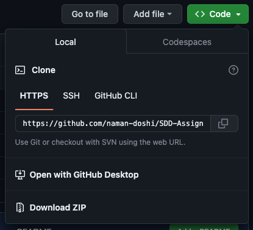

# WWTBUS User Documentation

A Software Design & Development multiple-choice quiz game, available for installation at.

---

---

# Overview

Welcome to Who Wants to be a University Student! This is a multiple-choice quiz game for the NSW Software Design and Development curriculum, and features up to 100 questions — some pre-written, and the rest generated by Google Bard.

Please make sure you have an internet connection to play this game!

<aside>
‼️ **DISCLAIMER:** Google Bard is not well-acquainted with the SDD syllabus, so there is a possibility that some questions are irrelevant or incorrect.

</aside>

# Getting Started

## Prerequisite — Having Python Installed

If you do not already have Python installed, please download the latest version here.

[Download Python](https://www.python.org/downloads/)

## Downloading

[https://github.com/naman-doshi/SDD-Assignment-Y11](https://github.com/naman-doshi/SDD-Assignment-Y11)

Please visit the link above, click the green “Code” button, and download the repository as a ZIP file.



Once the file is downloaded, unzip it with any tool of your choice.

### For Mac Users

1. Open Finder and navigate until you can see the new, unzipped folder.
2. Right click on the folder, and click “New Terminal at Folder”

### For Windows Users

1. Open File Explorer and navigate until you can see the new, unzipped folder.
2. Hold SHIFT and right click the folder — you should see an option to “Open in PowerShell” or “Open in Command Prompt”. Click either of these options.

## Running the Game

Type the following commands in your terminal window, making sure you are inside the folder titled SDD-Assignment-Y11.

```bash
pip3 install -r requirements.txt
python3 server/server.py
```

The game should have now opened in a new browser window!

# How To Play

## Introductory Page

When opening the website, you will be greeted with an introductory page explaining the rules of the game and allowing you to customise your game.


In the **options bar** above, you can customise:

- **The number of questions you want in the game.**
- **Whether you want to include preset questions or not.**
  - If you check this option, up to 20 pre-written questions from the topics Storage and Processing & Control will be included. If you choose more than 20 questions, the remaining questions will be generated by Google Bard.
    - For example, if you check the option and choose 50 questions, 20 will be preset and 30 will be AI-generated.
  - If you **do not** check the option, all questions will be AI-generated and will span all topics in the syllabus.

When you’re ready to start playing, press the purple “Start” button!

## Loading Page


<aside>
‼️ In the rare case that loading takes more time than indicated, please refresh the page and try again.

</aside>

If you have requested any AI-generated questions, there will be a short loading period while the program fetches questions.

It takes about 0.9 seconds to load each question, so loading times span from 9 seconds to 90 seconds. Sometimes, the questions will load in less time than is indicated!

After the questions are fetched, the game automatically starts.

## Gameplay & Rules


The text at the top depicts your current score — which is doubled for every correct answer and reset to 1 for every incorrect answer.

Directly below it is the the current question (bolded), and the four answer options. Click any of them to make your choice!

- If you select the **correct answer,** you will see confetti and your points will double!
- If you select the **incorrect answer,** you will not see confetti and your points will reset to 1.

## Ending Page


The ending page depicts your final score and the number of questions answered correctly. After each game, the result is saved to the file report.txt.

To see the file, navigate to **SDD-Assignment-Y11/server/report.txt**
